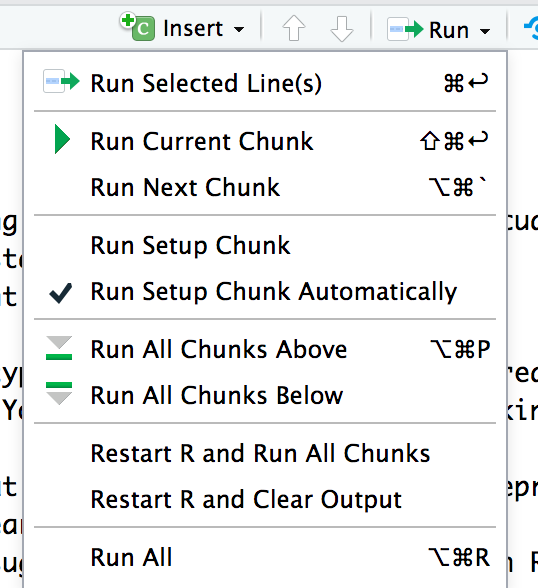

# __CRUK Online Introduction to R course__

1) This question requires you to practice using the command line and the 'calcuator mode' of the console. Click into it and then start your work.
Cut and paste your work here into this document when you have finished.   
We can convert between Fahrenheit and Centigrade with this formula:    
__$Degrees(C) = (Degrees(F) - 32 ) * \frac{5}{9}$__   
In the console convert the following Fahrenheit temperatures to Centigrade:       
45, 96, 451    
We can convert between Centigrade and Fahrenheit with this formula:    
__$Degrees(F) = Degrees(C)* \frac{9}{5} + 32$__   
In the console convert the following Centigrade temperatures to Fahrenheit:       
-65, 100, 20


2) In the console use the __:__ and __*__ operators to generate a sequence counting from 6 to 600.    


__For the following questions you will need to type your R code into the grey areas below the question (on the line beneath {r}). You can run your R code by clicking on the Run tab and selecting 'Run current chunk' option (you will note that there is also a key-press short-cut combination displayed on this option).__    
      

3) You need to generate an X-axis variable that incrememtally increases and represents the sampling at 5 day intervals for about a year (365 days).    
Your friendly neighbourhood statistician has suggested that there should be an R function to do that. What is the function and how do you find out about it and what is the code you will use to create the X-axis vector? Check the vector.
```{r}

```

4) You have been asked to plot some base R graphs of counts data. The investigator has requested that certain symbols be used for each dataset being plotted.    
What command would you use to find out the parameter which sets this for the plot.default() command and what is the parameters name?
```{r}

```

5) Your colleague has supplied you with the following table of data (number of cells per sample volume):   

| Day | LineA | LineB | LineC |
| --  | ---   | ---   | ---   |
| 1   |   4   |    5  |   14   |
| 2   |   9   |   17  |   16   |
| 3   |   7   |   22  |   10  |
| 4   |   12   |  20   |   14  |
| 5   |   23    |   24  |   20 |
| 6   |   8    |  18  |   12    |

Create some R vectors to hold this data and provide summary statisics for number of cells for each cell line. Plot some base R graphs if you like. Describe the data. 
```{r}

```

You are then provided with assay data that states that LineA had an activity of 4.2 per cell, LineB of 3.4 and LineC of 1.3.    
Use R to calculate the activities of each sample on each day and provide summary statistics of activity for each line.    
```{r}

```


