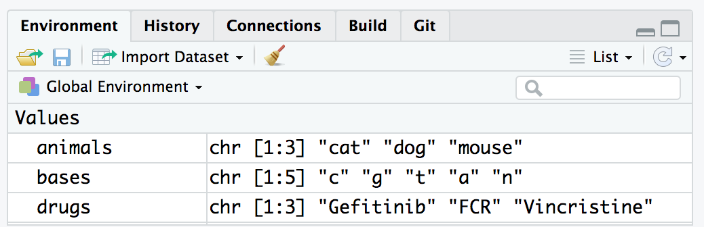

> #### Aims
>
> * To introduce Rstudio that we will be using, to write R scripts, in this course
> * To demonstrate the ways in which R can store data
> * To show how R functions can operate on such data
>
> #### Learning objectives
>
> * Learn about the functions of the various panes in Rstudio
> * Introduce the concept of vectors and the types of data that they can hold
> * Present the different ways that a user can access documentation in R and when to use them
> * Demonstrate the basic format for using an R function
> * Teach some simple but useful functions in R

# Introduction to R and RStudio

# Why learn R?

* R involves creating & using scripts which makes the steps you used in your analysis clear and can be inspected by someone else for feedback and error-checking.

* R code is great for reproducibility. An increasing number of journals and funding agencies expect analyses to be reproducible, so knowing R will give you an edge with these requirements.

* R integrates with other tools to generate manuscripts from your code.
This document (RMarkdown a .Rmd file) is a case in point.

* R is interdisciplinary and extensible and has thousands of installable packages to extend its capabilities. R has packages for image analysis, GIS, time series, population genetics, and a lot more.

* R scales well to work on data of all shapes and sizes.

* R can connect to spreadsheets, databases, and many other data formats, on your computer or on the web.

* R produces high-quality graphics suitable for publication in journals or the web.

* R has a large and welcoming community - Thousands use R daily and many of them are willing to help you through websites such as Stack Overflow or the RStudio community.

* Not only is R free, but it is also open-source and cross-platform.

---

# Rstudio  a brief tour

Rstudio provides us with a friendly interface to the R statistical progrmming language.
It consists of four main "Panes". These can be re-sized and moved around to suit how
you like to work.


## Editing pane

By default the top left-hand pane is one for creating, editing & running R scripts.


A script is an R program that you have written. A good practice is for that script to
perform only one role in your analysis workflow and so you may have several R scripts which you call, in a particular sequence, to analyse your data.

As you will see, a script is basically a text file that contains R commands and
(ideally) comments to explain what the codes function is (as a documentation process).

As well as R scripts, there are many types of Rstudio document including Markdown files which we will use in the teaching of this course. These can provide interactive workbooks or pdf and web documents to name but a few possible outcomes.

## Console

Coming down the screen to the bottom left-hand pane we find the console window. This is where we can find output produced by running our R scripts.


We can also try out snippets of R code here. Those of you who have only used graphical interfaces like Windows or MacOS where you click on commands using a mouse may find this aspect of R somewhat different. We type in commands to R using the command line.

This area can also be used like a calculator. Let's just type in something like `23 + 45` followed by the return key and see what happens. You should get the following:

```
> 23 + 45
[1] 68
```

Now 68 is clearly the answer but what is that 1 in brackets?

Here is another example to explain. If we type `1:36` and press enter, what happens?
R generates output counting from 1 to 36 but cannot fit all the output on one line and so starts another like this:

```
> 1:36
 [1]  1  2  3  4  5  6  7  8  9 10 11 12 13 14 15 16 17 18 19 20 21 22 23 24 25
[26] 26 27 28 29 30 31 32 33 34 35 36
```

Now we have two lines beginning with a number in square brackets. Note that the
number of values displayed on each line may differ on your computer; it largely
depends on the width of your console pane and the font size. Try creating a
larger sequence of numbers, e.g. `1:100`, if all 36 numbers fit on a single line
in your case.

This is just R helping us to keep tabs on which number we are looking at. `[1]` denotes that the line starts with the first result and the `[26]` denotes that this line starts with the 26th number. Let's try another one and generate a sequence incrementing in steps of 2:

```
> 1:36 * 2
 [1]  2  4  6  8 10 12 14 16 18 20 22 24 26 28 30 32 34 36 38 40 42 44 46 48 50
[26] 52 54 56 58 60 62 64 66 68 70 72
```

There are other tabs on this pane but we shall not be covering these on this course.

## Environment

Next we move to the top right-hand corner pane. Here we have even more tabs (of which we will only consider two Environment and History).



Environment keeps track on R variables which we create (more on those later) and their contents. History is like a tally role of all the R commands we have entered in our session.

## Files, Plots & Help

Our final bottom right-hand pane also has several tabs. The Files tab is a file explorer that enable us to move around our directories and select which files we wish to work on. We can also change the default working directory that Rstudio will use.


The Plots tab is where any graphs that we create in R will appear. We can move through them using the arrow buttons and the export button will convert them to different graphics formats e.g. for publication in a paper or for the web.

The Packages tab shows which R packages are installed (These expand R's functionallity and again will be covered later) and can also install new packages.

The Help tab is a _massively useful_ tab which enables you to search R help index to get help pages on R functions and provide example code to help you use them in your R scripts.

---

# Our first look at the R language

Our overall goal for this course is to give you the ability to import your data into R, select a subset
of the data most of interest for a given analysis, carry out an analysis to summarize these data and
create visualizations of the data.
First though, let us consider __“What is Data?”__

Data comes in many forms: Numbers (Integers and decimal values) or alphabetical  (characters or lines of text). Clearly a computer (or R) needs a way of representing this wide range of data with it’s diverse properties.

_The pigeon-hole analogy:-
R stores data in contiguous sections of computer memory a bit like the pigeon-holes used in many internal mail systems. These holes are indexed e.g by 1st letter of surname or a range of letters e.g. A-C.
Internal mail systems can carry different types of traffic small notes, large envelopes or parcels with different dimensions so there may be rows associated with small letters, big letters and parcels.
For a system like this it makes sense that a row contains the same type of mail with similar dimensions to avoid wasting space._

## Storing our first R data value

R has an equivalent to this called a Vector – everything is represented as a vector.
For example say we had a single numerical value 8 and this was the number of samples in an experiment – an R vector can be created (or assigned) thusly:

```{r}
samples <- 8
```

The `<-` is the assignment action and `samples` is the name of our vector.

If we just type `samples` followed by the return key R will print the contents of the vector called samples (Try it). Notice that Rstudio tries to help us by autocompleting the variable name to avoid mis-typing.

Be kind to yourself and use meaningful names for your vectors like `samples` rather than `s`. When you come back to your code after 6 months or give it to colleagues it will be more obvious what your program is doing and how it works. Also, note that the variable Samples is different to the variable samples (__Case matters__).

```{r}
samples <- 8
Samples <- 24
samples
Samples
```

What if we found out that there were actually 12 samples? We can correct this by re-assigning the value of samples:

Now try outputting the value – is it 12 or 8?

```{r}
samples <- 12
```

Of course our data is often a decimal value e.g.

```{r}
ph <- 5.5
```

Or we may have a name e.g. a _string_ of characters.

```{r}
drug <- "Gefitinib"
```

A less obvious type of data (but incredibly useful later on in this course) are logical values i.e. `TRUE` and `FALSE`.

```{r}
yes <- TRUE
no <- FALSE
yes
no
```

## Storing more than one value

We are much more likely to want to store a series of data e.g. observation values. Vectors can take any number of values but the assignment statement changes slightly.

```{r}
obs <- c(2, 5, 8, 5, 8, 2)
obs
vulcan <- c(TRUE, FALSE, !TRUE, !FALSE)
vulcan
```

What happens when you ask R to print obs?

__Note__ that with the logical vector we can use the __`!`__ operator to negate (or NOT) a logical i.e. `!TRUE` is equal to `FALSE`.

Calculations can also be included in assignments e.g. we might have a column supplied in one type of units and we need it in another.

```{r}
new_obs <- obs * 2.2
new_obs
smaller <- samples / 2
smaller
```

__Notice that each and every element of the vector has been multiplied by 2.2__. This is what was happening when we used `1:36 * 2` earlier.

Here are some more arithmetic operators you're likely to come across.

| Symbol | Effect              |
| ------ | ------------------- |
|    +   | Addition            |
|    –   | Subtraction         |
|    *   | Multiplication      |
|    /   | Division            |
|    ^   | Exponent            |
|   %%   | Modulus (Remainder) |
|  %/%   | Integer Division    |

__Note__ that when applying arithmetical functions to vectors they must be appropriate. For example, if you try and add 3 to the character string "a" then R will quite rightly return an error message.

```
> "a" + 3
Error in "a" + 3 : non-numeric argument to binary operator
```

Similarly, we can have long vectors of text strings:

```{r}
animals <- c('cat', 'dog', 'mouse')
drugs <- c('Gefitinib', 'FCR', "Vincristine")
bases <- c("c", "g", "t", "a", "n")
```

What happens if you print these?

## Our first  R function – help

Functions are like mathematical functions they take argument(s) and return a result and the arguments are enclosed in brackets i.e. $Y = F(X)$

They extend the capabilities of R. A function that you will find most ‘helpful’ is the help() function. It provides help on the topic that is supplied as the argument.

Try

```{r}
help(help)
```

The result appears in the bottom right-hand pane.

Notice how Rstudio tries to help you by suggesting what the arguments could be (in floating yellow text box).
_Need more help?_ You can also use ?<command> i.e. `?help`.

If you know roughly what you need but not the actual function name use `??` e.g. `??average`.

What if you know the function name but can't recall what the arguments are?
Try `args()` function e.g. `args(plot.default)`.

### More useful functions

__`length()`__ to find out how many elements are in a vector

```{r}
length(animals)
```

__`class()`__ will tell you the class (suprise) of a vector e.g. character or numeric

```{r}
class(animals)
class(obs)
```

__`str()`__ reports the structure of an object. This terse report includes such useful information as class, index range of elements e.g. 1..n and the values contained therein. The same output can be seen for each object in
the Environment pane in the top right-hand pane.

```{r}
str(obs)
```

__`typeof()`__ - reports how object is stored e.g. character, integer, double or logical.  If we explicitly want a vector to be integer-only we can use another function __`as.integer()`__ or a suffix of __`L`__ when we assign it (see below).

```{r}
?typeof
samples
typeof(samples)
hint <- 5L
hint2 <- as.integer(25)
hint
typeof(hint)
hint2
typeof(hint2)
drug
typeof(drug)
```

So what does R mean by these types and why would we use one over another? What does R have to tell us on this topic?

```{r}
?integer
```

```{r}
?double
```

```{r}
?character
```

__Integer__ - whole discrete numbers e.g. numbers of mice, cell counts.

__Double__ - continuous decimal values e.g. specific activity or a voltage reading.

__Character__ - A string of one to N alphanumeric characters e.g. a drug name.

__Factor__ - A new one. Categorical values that may or may not have any heirachical order e.g. drug1, drug2, drug3. We would use these to seperate data e.g. when plotting. More about factors later in the course.

Computational aspects of these types relate to space required to store the value (number of bytes) and speed at accessing the value. Order of lowest to highest is typically: integer, double and character. However, unless you are dealing with huge quantities of data or lots of processing, this is unlikely to affect your programs.

__Important__ - you can only store one type of data in any one vector i.e. all logical or all character etc. If you mix them, R will store them in the lowest common denominator of type in order to preserve as much information as possible about the value.

__`summary()`__ -  one of my __favourite__ functions. R gives an object summary of the vector. this means that what is returned depends on the vector. I often use it on data after I have read it in from a file to do a 'sanity check' and find maximum and minimum values etc to spot unexpected (and possibly erroneous) values.

```{r}
summary(obs)
```

So-called 'Base' R does possess plotting functions. However, later lessons will teach you how to plot using a much more powerful and easy-to-use _tidyverse_ package called _ggplot2_.

Just to demonstrate a function with multiple parameters, I will use base R plot here. Once you have read in your data you may wish to do a quick & dirty plot it e.g. to spot any trends or outliers. This can be done quickly in R (but much finer control in ggplot2).

```{r scatter_plot}
 X <- c(1,2,3,4,5)
 Y <- c(9, 17, 23, 38, 52)
 plot.default(X, Y, pch = 4, col = "red")
```

__A point to note here__ - In the help you will notice that parameters are usually presented in a specific order in the brackets. This will work fine, but you may wish to take default values or enter parameters out of order.
You can do this by using a parameter name e.g. the plot character is called 'pch' and we can put `pch = N` anywhere between the brackets.
However, just because you can is not a good reason. Doing things out of order for no reason can make your code less readable.

---

# Summary

In this session we have covered the following concepts:

* The Rstudio environment and the functions associated with each pane
* Using the RStudio console as a calculator and place to test out R code
* Storing a single item of data in an R vector
* Storing multiple items of data in an R vector
* Arithmetic operators and applying them to R vectors
* Calling functions in R
* Many different ways of getting help within R
* Learning about the different types of vector in R (integer, double, character)
* Further details on how we can supply parameters to an R function

We also cover how to work within an R markdown document and run code therein in this
week's assignment.

---

Over to you for the assignment - see you again at the end of the week!

Assignment: [assignment1.Rmd](assignments/assignment1.Rmd)

Solutions: [assignment1_walkthrough.Rmd](assignments/assignment1_walkthrough.Rmd)

