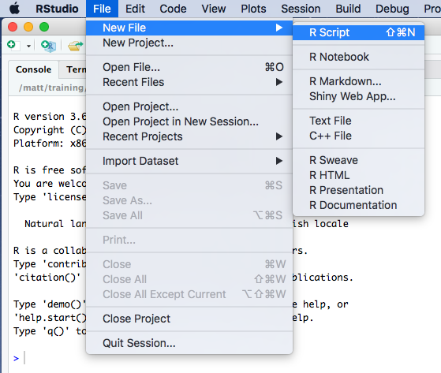
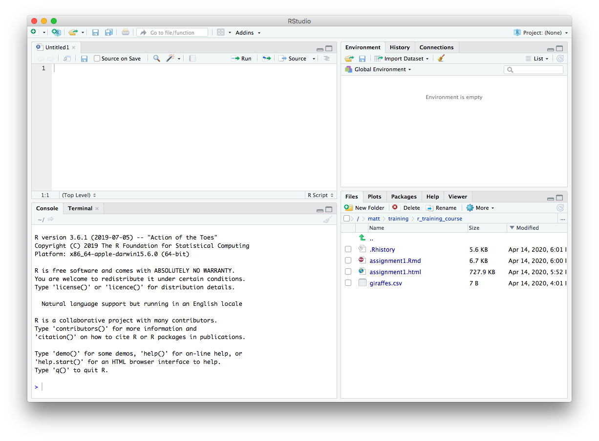
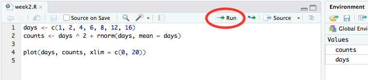

> ### Learning objectives
>
> * Create and run a script file containing your R code
> * Extract values or subsets from vectors
> * Modify values within a vector
> * Perform vector arithmetic
> * Introduce more sophisticated data structures (lists and data frames)
> * Learn how to install and use packages that extend R's basic functionality
> * Read data in tabular format into R
> * Calculate summary statistics on your tabular data
> * Introduce the **`tibble`**, arguably the most important data structure you will use in R
> * Learn how R deals with missing values

# Introduction

In this course, we'll be mostly focusing on a set of R packages specifically
designed for the most useful and common operations for interacting with and
visualizing data, and particularly data in a tabular form. This collection of
packages is known as the **tidyverse**.

Learning the **tidyverse** is more than just learning about some helpful
functions to get certain tasks done. The tidyverse packages form a coherant
system for data manipulation, exploration and visualization that share a common
design philosophy. There is a certain elegance to code crafted using the
tidyverse approach that is in stark contrast to the strange and often cryptic
equivalent using traditional 'base R'. This old-timer only really became a true
R convert on being introduced to the tidyverse.

Sadly, as much as we'd like, we can't just cover the tidyverse alone and
ignore the fundamentals of the R language. So this week we will look at some
aspects of R that are crucial to understanding how R is handling your data,
even though we will come back to some of these concepts in later weeks to show
you how those same operations are more easily and elegantly carried out in
the tidyverse.

We will also start to look at the most important data structure you'll use
with your data, assuming it is in tabular form, the **data frame**, and its
superior tidyverse derivative, the **tibble**.

# Scripts

Up to now, we were mostly typing code in the Console pane at the **`>`** prompt.
This is a very interactive way of working with R but what if you want to save
the commands you've typed for a future session working in R?

Instead we can create a script file containing our R commands that we can come
back to later. This is the way most R coding is done so let's have a go.

From the RStudio '**File**' menu, select '**New File**' and then '**R Script**'.

{width=50%}

You should now have a new file at the top of the left-hand side of RStudio for
your new R script named 'Untitled1'. The Console window no longer occupies the
whole of the left-hand side.

{width=100%}

We can type code into this file just as we have done in the Console window at
the command prompt.

Type in some of the commands from last week's assignment. Do you notice that the
file name on the tab for this pane is now highlighted in red and has an
asterisk?

{width=50%}

This tells us that we haven't yet saved our changes. There are various ways to
do so just like in Word or Excel or other applications you're familiar with, for
example using the '**Save**' option from the '**File**' menu or clicking on the
'**Save**' button.

My preference by far is to use a keyboard shortcut. On a Mac this would be
<kbd>cmd</kbd> + <kbd>S</kbd> (press the <kbd>cmd</kbd> key first and, while
keeping this depressed, click the <kbd>S</kbd> key); on Windows you would do the
same thing using <kbd>Ctrl</kbd> + <kbd>S</kbd>.

If the file already exists it will be saved without any further ado. As this is
a new file, RStudio needs to know what you want to call it and in which folder
on your computer you want it to be saved. You can choose the file name and
location using the file dialog that appears. RStudio will add a '.R' suffix if
you don't specify one.

It is a good idea to keep your scripts and assignment files for this course
together in one folder or directory.

## Running scripts

Having typed an R command and hit the return key you'll notice that the
command isn't actually run like it was in the console window. That's because
you're writing your R code in an editor. To run a single line of code within
your script you can press the '**Run**' button at the top of the script.



This will run the line of code on which the cursor is flashing or the next line
of code if the cursor is on a blank or empty line.

The keyboard shortcut is more convenient in practice as you won't have to stop
typing at the keyboard to use your mouse. This is <kbd>cmd</kbd> +
<kbd>return</kbd> on a Mac and <kbd>Ctrl</kbd> + <kbd>enter</kbd> on Windows.

Running a line in your script will automatically move the cursor onto the
next command which can be very convenient as you'll be able to run successive
commands just by repeatedly clicking '**Run**' or using the keyboard shortcut.

You can also run the entire script by clicking on the '**Source**' button, a
little to the right of the '**Run**' button. More useful though is to run 
'**Source with Echo**' from the Source drop-down menu as this will also display
your commands and the outputs from these in the Console window.

## Adding comments to scripts

It is a very good idea to add comments to your code to explain what it's doing
or what you intended. This will help others to understand your code and more
than likely even yourself when you come to revisit it a few weeks or months
later.

Anything following a **`#`** symbol is a comment that R will ignore. Here's an
example of adding comments to our simple script.


Comments usually appear at the beginning of lines but can appear at the end of
an R statement.

```{r}
days <- c(1, 2, 4, 6, 8, 12, 16) # didn't manage to get a measurement on day 10
```

It is also quite common when looking at R code to see lines of code commented
out, usually replaced by another line that does something similar or makes a
small change.

```{r}
# random_numbers <- rnorm(100, mean = 0, sd = 1)
random_numbers <- rnorm(100, mean = 0, sd = 0.5)
```

# Vectors

In week 1 we introduced **vectors**, the simplest type of data structure in R.
An atomic vector is a collection of values or things of the same type in a given
order. We created some last week using **`c()`** and the **`:`** operator.

```{r}
some_numbers <- 1:10
days_of_the_week <- c("Sunday", "Monday", "Tuesday", "Wednesday", "Thursday", "Friday", "Saturday")
```

In the first example, an integer vector was created with 10 values from 1 to 10.
`some_numbers` is a name that refers to the vector and can be used in other R
statements while `1:10` is the vector object itself.

```{block type = "rmdblock"}
**`:` operator**

The colon operator (**`:`**) returns every integer between two integers. These
can be in ascending or descending order and can include negative numbers.

`countdown <- 10:1`

`including_some_negative_numbers <- -4:3`
```

A single value is known as a **scalar**. An example from last week was the
number of samples in our experiment.

```{r}
samples <- 8
samples
```

But as we saw last week, R doesn't treat this single value any differently;
it is still a vector, just one that has a length of 1.

```{r}
length(days_of_the_week)
length(samples)
```

Almost every object in R is a vector of one kind or another, or is constructed
of vectors, so it's really important to understand these well.

```{block type = "rmdblock"}
**`length()`**

The `length()` function returns the number of elements in a vector.

`length(8:15)`
```

## Combining vectors

The other way we've encountered for creating a vector is to use **`c()`**. This
is actually a function and we can get help for it just as we can for any other
function.

```{r eval = FALSE}
?c
```

From the help page you can see that `c` stands for 'combine' (or perhaps
'concatenate' as both terms are used in the documentation).

One of the most useful things about the help pages for functions are the
examples that are given -- you'll need to scroll down to the bottom of the help
page to see them. These can be really helpful in demonstrating how a function
works. You can very easily cut and paste these examples and run these in the
console window as a way of experimenting with and learning about the function.

Let's have a look at the first example from the help page for `c()`. It's
slighly more complicated than what we did last week.

```{r}
c(1, 7:9)
```

This is actually combining two vectors, the first with a single value `1`
and the second with values `7`, `8` and `9`. Here's another example:

```{r}
cats <- c("felix", "kitty", "tigger")
dogs <- c("spot", "snoopy")
cats_and_dogs <- c(cats, dogs)
cats_and_dogs
```

```{block type = "rmdblock"}
**`c()`**

The `c()` function is a generic function that combines its arguments, i.e. the
things you pass to the function by including these within the parentheses, `()`.
You can pass as many vectors as you like to `c()` and it will concatenate these
into a single vector.

Arguments will be coerced to a common type.

`c(1:5, 10.5, "next")`
```

## Coercion

Atomic vectors must contain values that are all of the same type. A bit later
on, we'll introduce another type of data structure that doesn't have this
restriction -- the list. First though, a look at back at one of the exercises
from last week's assignment in which we tried to create vectors of things
that are of different types.

```{r}
integer_logical <- c(1:5, c(TRUE, FALSE, TRUE))
integer_logical
typeof(integer_logical)
```

Combining an integer vector, `1:5`, containing the numbers 1 through 5, with a
logical vector results in an integer vector. The logical values have been
*'coerced'* into integers. But why the logical values and not the integers to
produce a logical vector?

If you think about it, it makes more sense to convert logical values where
`TRUE` and `FALSE` are usually represented in computers by the bits `1` and `0`
respectively. `TRUE` and `FALSE` have natural and understandable equivalents in
the world of integers. Which logical value would you give to the number 5 for
example?

Similarly, integers get converted to doubles in this example:

```{r}
integer_double <- c(3.4, 7, 2.3, 6:-3)
integer_double
typeof(integer_double)
```

Again, this makes more sense than converting doubles (numbers with a decimal
point) to integers (whole numbers) and losing some of their precision.

Finally, it is really not obvious how to convert most character strings into
either logical or numeric values, so when combining vectors that contain
characters everything else gets 'coerced' into becoming characters.

```{r}
we_all_want_to_be_characters <- c(FALSE, 1:5, 23L, 3.23, 5.2e4, 1e-6, "matt")
we_all_want_to_be_characters
typeof(we_all_want_to_be_characters)
```

## Extracting subsets

One of the operations we do frequently on our data is to select subsets that
are of particular interest. For example, we may be interested in the top 50
genes in a differential expression analysis for our RNA-seq experiment where
those genes of interest are the ones with a log fold change above a certain
value and with a *p*-value below 0.01.

Having a good understanding of how to select a subset of values from a vector
is going to be invaluable when we come to do the same for more complicated
data structures so let's take a look.

The main subsetting operator we'll use is the square bracket, **`[]`**. Here's an
example.

```{r}
log2fc <- c(2.3, -1, 0.48, 0.97, -0.02, 1.23)
log2fc[3]
```

We have a vector of six log~2~ fold change values and we've chosen to select
the third value.

If you're familiar with other programming languages you will notice that the
indexing scheme in R starts from 1, not 0. So the first element in the vector
is referred to using the index 1, i.e. `log2fc[1]`.

Multiple values can be extracted by providing a vector of indices, e.g.

```{r}
log2fc[c(2, 4, 5)]
```

You can also extract elements in a different order, e.g.

```{r}
log2fc[c(2, 5, 4)]
```

It is possible to exclude values instead by providing negative indices, e.g. to
exclude the second element:

```{r}
log2fc[-2]
```

Or to exclude multiple elements:

```{r}
log2fc[-c(2, 3)]
```

Finally, we can also subset our vector using a vector of logical values.

```{r}
log2fc[c(TRUE, FALSE, TRUE, TRUE, FALSE, FALSE)]
```

```{block type = "rmdblock"}
**Parentheses `()` and brackets `[]`**

Remember to use **`()`** for **functions** and **`[]`** for **subsetting**.

`my_vector <- c(1, 7:9)`

`my_vector[2]`
```

### Conditional subsetting

You may be thinking that the last example in which we extracted a subset using
logical values seems very abstract and why on earth it could possibly be useful.
But actually, it is probably the most frequently used way of selecting values of
interest. To understand why, we'll need to introduce the concept of logical
operators.

Let's say we're interested in just the log~2~ fold changes that are above a
threshold of 0.5. We can test each of the values using the **`>`** logical
operator.

```{r}
log2fc > 0.5
```

This results in a logical vector containing `TRUE` and `FALSE` values for each
element. The values at positions 1, 4 and 6 in our vector are above the
threshold so result in `TRUE`, the others result in `FALSE`.

We can use this resulting vector to subset our original `log2fc` vector.

```{r}
above_threshold <- log2fc > 0.5
log2fc[above_threshold]
```

In practice, we wouldn't really create a variable containing our logical vector
signifying whether values are of interest. Instead we'd do this in a single
step.

```{r}
log2fc[log2fc > 0.5]
```

However, in a real R script, we might not want to hard-wire the threshold of 0.5
but instead let the user specify this each time the script is run, e.g. by
passing in the value as a command-line argument. If we have a variable storing
the desired threshold value, e.g. `log2fc_threshold`, then we would write the
above as follows.

```{r}
log2fc_threshold <- 0.5
log2fc_above_threshold <- log2fc[log2fc > log2fc_threshold]
log2fc_above_threshold
```

We also captured the result in another vector called `log2fc_above_threshold`
although we could have overwritten our original log2fc if we wanted to by
assigning the result back to log2fc.

```{r}
log2fc <- log2fc[log2fc > log2fc_threshold]
```

You can combine two or more conditions using **`&`** if you want both conditions
to be true or using **`|`** if either of the conditions holds.

```{r}
# reset our log2fc vector to how it was originally
log2fc <- c(2.3, -1, 0.48, 0.97, -0.02, 1.23)
# find small fold changes
log2fc[log2fc < 0.5 & log2fc > -0.5]
```

```{r}
# find large fold changes
log2fc[log2fc > 1 | log2fc < -1]
```

`&` and `|` are the R versions of the AND and OR operations in Boolean algebra
but applied to vectors.

### Logical operators

The following table lists the logical operators you can use in R.

| Operator | Description              |
| -------- | ------------------------ |
|   < 	   | less than                |
|   <=     | less than or equal to    |
|   > 	   | greater than             |
|   >= 	   | greater than or equal to |
|   == 	   | exactly equal to         |
|   != 	   | not equal to             |
|   !x     | NOT x                    |
| x \| y 	 | x OR y                   |
| x & y    | x AND y                  |

`x` and `y` in the last 3 of these operators are intended for logical values; if
you apply them to other types, those other types will be coerced to logicals in
exactly the same way we saw earlier.

## Modifying subsets

All subsetting operations can be combined with assignment. So we can modify or
overwrite the values at specified position in our vector.

```{r}
some_numbers <- 1:10
some_numbers[c(2, 4, 8)] <- c(150, 34, -10)
some_numbers
```

And, as before, we could use a condition to decide which values to change. For
example, you may decide that log~2~ fold changes above 1 are somewhat unreliable
with your detection method and so you'd like to put a cap on any values above
this limit.

```{r}
log2fc[log2fc > 1] <- 1
log2fc
```

# Vector arithmetic

Many operations in R are **vectorized**, which means that the operation is
applied to an entire set of values at once. We've already seen lots of examples
of this, like the following:

```{r}
some_numbers <- 1:10
square_numbers <- some_numbers ^ 2
square_numbers
```

Here we used the **`^`** exponent operator to raise our numbers to the power of
2. This happened in a single operation, i.e. just one line of code. In other
computer languages we might have had to write what is known as a loop in order
to iterate over and perform the calculation for each value in turn.

Another way of writing the above statement to get the same result would be to
multiply our numbers by themselves.

```{r}
square_numbers <- some_numbers * some_numbers
square_numbers
```

What actually happened here was slightly different though. Two vectors
(actually the same vector in this case) of the same length were multiplied
together. R did this **_element-by-element_**, which means that the first
element from the first vector was multiplied by the first element of the second
vector. Likewise, the second elements from each vector were multiplied by each
other and so on.

Here's another example involving two different vectors, but again these are
of the same length.

```{r}
1:10 + 10:1
```

Can you see why we get this result? (type `10:1` in the console if you're
not sure about what that gives).

Usually vector arithmetic involves two vectors of the same length or involves
a vector and a scalar (a vector of length 1). One of the first examples from
last week was the second scenario involving a vector and a single value.

```{r}
1:36 * 2
```

## Vector recycling (advanced)

It is possible to perform calculations using two vectors of different sizes.
When R runs out of values to use from the shorter of the two vectors, it wraps
around to the beginning of that shorter one. For example, we can set every other
value in our set of numbers to be negative as follows:

```{r}
some_numbers * c(1, -1)
```

When R gets to the third element it has exhausted the shorter vector,
`c(1, -1)`, so it goes back to the beginning, i.e. back to the first value,
`1`. It uses the second vector five times in what is referred to as **_vector
recycling_**.

You will probably never have to do something like this (why would you?) but
without you knowing it you will carry out vector arithmetic using recycling
very frequently. This is because a very common operation is to carry out a
calculation on a vector using a single scalar value. For example, multiplying
all values by a constant.

```{r}
heights_in_metres <- c(1.86, 1.65, 1.72, 1.4, 1.79)
heights_in_centimetres <- 100 * heights_in_metres
heights_in_centimetres
```

The multiplier of 100 is effectively being recycled and so is equivalent
to us having written the following:

```{r}
heights_in_centimetres <- c(100, 100, 100, 100, 100) * heights_in_metres
```

R will give a warning if we carry out vector arithmetic on two vectors where the
length of one of those vectors is not an exact multiple of the length of the
other.

```{r}
1:7 * c(1, -1)
```

# Combining data of different types

Vectors are all very well and good but your data are almost certainly more
complicated than an ordered set of values all of the same type. You've probably
been working with Excel spreadsheets that contain some columns that are
numerical while others contain names or character strings, e.g. the following
table of Star Wars characters.

```{r echo = FALSE, message = FALSE}
DT::datatable(dplyr::select(dplyr::starwars, name, height, mass, gender, species, homeworld), rownames = FALSE)
```

Note that the first column contains character type data, the second and third
columns contain numerical data (of type double) and the remaining columns
contain the special type we briefly touched on last week, factors, that look
like character types but have a limited set of values or categories.

## Lists

R's simplest structure that combines data of different types is a **list**.
A list is a collection of vectors. It is also a vector itself but is a step up
in complexity from the atomic vectors we've been looking at up until now.
Vectors in a list can be of different types and different lengths.

```{r}
my_first_list <- list(1:10, c("a", "b", "c"), c(TRUE, FALSE), 100, c(1.3, 2.2, 0.75, 3.8))
my_first_list
```

`my_first_list` has five elements and when printed out like this looks quite
strange at first sight. Note how each of the elements of a list is referred to
by an index within 2 sets of square brackets. This gives a clue to how you can
access individual elements in the list.

```{r}
my_first_list[[2]]
```

The line of code in which we created this list is a little difficult to read and
might be better written split across several lines.

```{r}
my_first_list <- list(
  1:10,
  c("a", "b", "c"),
  c(TRUE, FALSE), 100,
  c(1.3, 2.2, 0.75, 3.8)
)
```

The editor in RStudio will indent code to help this look clearer. The R
interpretor is fully able to cope with code split across multiple lines; it will
assume this is what you're doing if it doesn't think the current line of code is
complete.

Elements in lists are normally named, e.g.

```{r}
genomics_instruments <- list(
  sequencers = c("NovaSeq 6000", "HiSeq 4000", "NextSeq 500", "MiSeq"),
  liquid_handling_robots = c("Mosquito HV", "Bravo")
)
genomics_instruments
```

We can still access the elements using the double square brackets but now we
can use either the index (position) or the name.

```{r}
genomics_instruments[[1]]
genomics_instruments[["sequencers"]]
```

Even more conveniently we can use the **`$`** operator.

```{r}
genomics_instruments$sequencers
```

You can see what the names of elements in your list are using the **`names()`**
function.

```{r}
names(genomics_instruments)
```

## Data frames

A much more useful data structure and the one we will mostly be using for the
rest of the course is the **data frame**. This is actually a special type of
list in which all the elements are vectors of the same length. The data frame is
how R represents tabular data like the Star Wars table.

There are a number of example data frames lurking in the background just waiting
for you to call on them. Many of the examples for functions given in the help
pages make use of these. Two such data frames that are often used in example
code snippets are **`iris`** and **`mtcars`**. See, for example, the help page
for the `unique()` function in which `iris` appears in the last code example
without any explanation of what the mysterious `iris` is and potentially causing
some confusion to the uninitiated.

To bring one of these internal data sets to the fore, you can just start using it
by name.

```{r eval = FALSE}
iris
```

```{r echo = FALSE}
head(iris)
```

Here we've only displayed the first few rows. If you type `iris` into the
console pane you'll notice that it prints the entire table with row numbers
that indicate that the data frame contains measurements for 150 irises.

You can also get help for a data set such as `iris` in the usual way.

```{r eval = FALSE}
?iris
```

This reveals that `iris` is a rather famous old data set of measurements taken
by the esteemed British statistician and geneticist, Ronald Fisher (he of
Fisher's exact test fame).

### Creating a data frame

A data frame can be created in a similar way to how we created a list. The only
restriction is that each of the vectors should be named and all must have the
same length.

```{r}
beatles <- data.frame(
  name = c("John", "Paul", "Ringo", "George"),
  instrument = c("guitar", "bass", "drums", "guitar")
)
beatles
```

### Extracting values from a data frame

A data frame is a special type of list so you can access its elements in the
same way as we saw previously for lists.

```{r}
names(iris)
iris$Petal.Width # or equivalently iris[["Petal.Width"]] or iris[[4]]
```

```{block type = "rmdblock"}
**`\$` operator**

Use `\$` to extract an element from a list or a column from a data frame by name.

`iris$Species`
```

In that last example we extracted the `Petal.Width` column which itself is a
vector. We can further subset the values in that column to, say, return the
first 10 values only.

```{r}
iris$Petal.Length[1:10]
```

We can also select a subset of columns as follows:

```{r eval = FALSE}
iris[c("Petal.Width", "Petal.Length", "Species")] # or equivalently iris[c(4, 3, 5)]
```

```{r echo = FALSE}
head(iris[c("Petal.Width", "Petal.Length", "Species")])
```

Data frames have rows and columns both of which have names that can be used to
extract subsets of our tabular data. You can get those names using
**`rownames()`** and **`colnames()`**.

```{r}
colnames(iris) # this is essentially the same as names()
rownames(iris)
```

In this case the row names are just numbers but did you notice that these
row numbers are all displayed in quotation marks? They are in fact character
strings.

```{r}
typeof(rownames(iris))
```

If we take a look at the `mtcars` data frame we can see that the row names are
models of cars.

```{r}
rownames(mtcars)
```

We could look up the row for a particular car using the square bracket notation
but in a slightly different and odd-looking way.

```{r}
mtcars["Ferrari Dino", ]
```

The **`,`** is somehow telling R to subset based on rows, not columns. If you
omit the comma, R will think you're referring to columns and will complain
because it can't find a column named "Ferrari Dino" (give it go and see for
yourself).

Similarly we can extract multiple rows by providing a vector of car names:

```{r}
mtcars[c("Ferrari Dino", "Maserati Bora"), ]
```

This way of accessing the data frame makes more sense when we look at how
we can access subsets of rows and columns at the same time, for example
selecting the first three rows and the first five columns.

```{r}
mtcars[1:3, 1:5]
# equivalent to mtcars[c("Mazda RX4", "Mazda RX4 Wag", "Datsun 710"), c("mpg", "cyl", "disp", "hp", "drat")]
```

We can extract just a single element in our table.

```{r}
mtcars[4, 3]
```

Other useful functions for data frames are **`dim()`**, **`nrow()`** and
**`ncol()`** that let you know about the dimensions of your table.

```{r}
dim(mtcars)
nrow(mtcars)
ncol(mtcars)
```

Some functions work just as well (or even better) with data frames as they do
with vectors. Remember the **`summary()`** function from last week? Let's give
that a go on the `iris` data frame.

```{r}
summary(iris)
```

Wow, that's amazing! One simple command to compute all those useful summary
statistics for our entire data set.

The summary for numerical columns contains the minimum and maximum values, the
median and mean, and the interquartile range. The `Species` column contains
categorical data (stored as a special `factor` type in R) and `summary()` shows
how many observations there are for each type of iris.

```{block type = "rmdblock"}
**Subsetting data frames**

Get the first element in the first column.

`iris[1, 1]`

Get the first element from the fifth column.

`iris[1, 5]`

Get the fourth column as a vector.

`iris[, 4]`

Get the fourth column as a data frame.

`iris[4]`

Get the first 10 elements from the fourth column.

`iris[1:10, 4]`

Get the third row as a data frame.

`iris[3, ]`

Get the first 6 rows (equivalent to `head(iris)`).

`iris[1:6, ]`

Get a column by name as a vector.

`iris$Petal.Length`

Get several columns by name as a data frame.

`iris[c("Petal.Length", "Petal.Width", "Species")]`

Get specific rows and columns.

`mtcars[c("Ferrari Dino", "Maserati Bora"), c("mpg", "cyl", "hp")]`
```

### Viewing data frames

One last aside before moving on to the more user-friendly tidyverse version of
the data frame, the tibble. Earlier we truncated the data frame when printing it
out because it was really a bit too long to digest in one go. Although we hid
this from view, we used the **`head()`** function.

```{r}
head(iris)
```

You can specify how many rows to return from the 'head' (top) of the data frame
-- have a look at the help page to see how. Also, the help page lets you know
about the equivalent function, **`tail()`**, for returning the last few rows.

Another way of inspecting the contents of a data frame in RStudio is to bring up
a spreadsheet-style data viewer using the `View()` function.

```{r eval = FALSE}
View(iris)
```

This will open a new tab pane in the top left-hand part of RStudio alongside
any script or markdown files you have open.


This viewer has some handy filtering capabilities - try using the search box,
e.g. by entering the search term 'versi', and see what happens.

All the data objects you've created are listed in the Environment tab pane (top
right-hand side in RStudio) -- double-clicking on an object in this pane will
also open it in the viewer.

# Data semantics

From "Tidy Data" by Hadley Wickham, *The Journal of Statistical Software*, vol.
59, 2014.

> *A data set is a collection of **values**, usually either numbers (if*
> *quantitative) or character strings (if qualitative). Values are organised in*
> *two ways. Every value belongs to a **variable** and an **observation**.*
>
> *A variable contains all values that measure the same underlying attribute*
> *(like height, temperature, duration) across units.*
>
> *An observation contains all values measured on the same unit (like a person,*
> *or a day, or a race) across attributes.*

The data frame represents observations as rows and variables or attributes as
columns.

The `iris` data set has 150 observations (i.e. 150 rows), one for each iris
plant from which measurements were recorded. The variables are the petal width
and length, sepal width and length and species, each of which is an underlying
attribute of an iris plant. An observation is the set of measurements or
attributes recorded for a single iris plant.

# Packages

Before we move on to the tidyverse version of a data frame, the tibble, we have
to load the tidyverse package that provides the tibble functionality. It doesn't
come with the set of packages loaded when you first start R.

There are thousands of R packages that extend R's core functionality to provide
specialized functions for doing all kinds of things. There are R packages that
provide various kinds of visualizations and plotting functions, others that let
us manipulate data in interesting and useful ways, and still others that give us
access to cutting-edge machine learning algorithms. Several packages have been
developed by statisticians and bioinformaticians at CRUK CI, mainly focusing on
genomic and transcriptomic analysis methods.

You need to load a package using the **`library()`** function in order to be
able to use the functions and data sets that the package provides. The tibble
data structure is part of the **`tibble`** package so to make this available you
would run the following command:

```{r eval = FALSE}
library(tibble)
```

The `tibble` package also contains various useful functions for converting other
data structures, e.g. data frames, to tibbles and for working with tibble
objects.

The `tibble` package is one of a collection of packages that make up the
tidyverse. It is usually more convenient to load the core tidyverse packages
in one go as follows.

```{r}
library(tidyverse)
```

The output from this command tells us which packages were loaded, one of which
is the `tibble` package. Another of these is `ggplot2` that provides excellent
plotting functions for visualizing our data and will be the main focus next
week.

We also got a warning about some conflicts. This tells us that there are
functions loaded as part of the `dplyr` package that have the same name as
functions that are in the `stats` package. The `stats` package was already
loaded, from when we first started our R session, and the functions referred to
in the warning are now masked; to use these instead of their `dplyr` namesakes
you need to specify them fully by adding the package name and `::` as shown in
the warning message.

## Installing packages

If you got the following error message when trying to load the tidyverse, then
you haven't yet installed it.

```
> library(tidyverse)
Error in library(tidyverse) : there is no package called ‘tidyverse’
```

Installing packages should be relatively straightforward using the
`install.packages()` function.

```{r eval = FALSE}
install.packages("tidyverse")
```

If you're using R at a regular console within a terminal window, i.e. not
RStudio, you may be asked to select one of several mirrors of the CRAN R package
repository hosted at different locations around the world (in the UK these are
in Bristol and London).

For some packages you may be asked to choose between a binary and a source
package, particularly if the latest version of the package is only available in
source form and that package contains code written in another language such as
C. This could be a problem if you don't have a C compiler installed on your
computer.

# Tibbles

The tidyverse brings us a special type of data frame called the **`tibble`**.

Data frames have some rather quirky and annoying behaviours and the `tibble`
addresses some of these issues to make life a little easier. We'll first look at
how we can create a tibble and then will have a quick look at some of the
advantages of the tibble over the data frame.

## Creating a tibble

Tibbles can be created using the `tibble()` function in a similar manner to how
we created a data frame earlier.

```{r}
beatles <- tibble(
  name = c("John", "Paul", "Ringo", "George"),
  instrument = c("guitar", "bass", "drums", "guitar")
)
beatles
```

A data frame can be converted into a tibble using the `as_tibble()` function.

```{r}
iris_tibble <- as_tibble(iris)
```

Our iris tibble is still a data frame but it also has acquired some additional
types or classes (`tbl_df` and `tbl`).

```{r}
class(iris)
class(iris_tibble)
```

Because tibbles are data frames, almost everything we learned about data frames,
including subsetting, also applies to tibbles.

## Tibbles vs data frames

So let's now have a look at what capabilities and behaviours these additional
types confer and what the main differences are between tibbles and data frames.

### Printing

If you typed `iris` at the command prompt to list its contents it will have
printed all 150 lines. At times this can feel a bit unwieldy, as we may just
want a quick look at the first few rows to get an idea of what our data frame
looks like. Hence the need for the `head()` function.

Tibbles print in a much more user-friendly way. Only the first 10 rows are
displayed and only as many columns as can fit comfortably on the screen. This is
best demonstrated with a table with many columns such as the `starwars` table we
came across earlier. `starwars` is in fact one of those hidden data sets but it
is part of the `dplyr` package so can only be accessed if you load `dplyr` using
`library(dplyr)` or as part of loading the tidyverse collection of packages
using `library(tidyverse)`.

```{r}
starwars
```

The dimensions of the tibble are shown on the first line of output and the types
of each of the columns (variables) are also displayed in shorthand form. So we
easily see that the name column is a character vector and the height column
contains integer values, while the mass column contains doubles.

Values in some columns have been shortened with `...` in order to fit as many
columns on the screen as possible. Those columns that it couldn't fit on are
listed after the first 10 rows.

### Not trying to be too clever

The other main thing that tibbles do is to curb some strange behaviours that the
developers of R thought were a good idea at the time but which can cause some
confusion.

Let's reconsider how we created the `beatles` data frame.

```{r}
beatles <- data.frame(
  name = c("John", "Paul", "Ringo", "George"),
  instrument = c("guitar", "bass", "drums", "guitar")
)
```

What type do you think the name and instrument columns are?

If you think these should be characters, think again. Or inspect these using
`str()` or `class()`.

```{r}
str(beatles)
```

```{r}
class(beatles$name)
```

The `data.frame()` function automatically converts character vectors into
factors. Factors are categorical variables, i.e. have a restricted set of
values, a controlled vocabulary if you like.

Why did it do this? I never asked it to. Those vectors started as character
vectors, why does `data.frame()` think I want these to be factors?

To be fair, the instruments variable probably should be a factor but it's
hard to see why the name would be.

If you look at the help page for the `data.frame()` function, you'll see that
you can prevent this behaviour by setting the argument `stringsAsFactors =
FALSE`. Likewise, it is very common to see code in which this same argument is
set to `FALSE` in the base R functions for reading tabular data from a
tab-delimited or comma-separated value (CSV) file.

Tibbles do not automatically convert character string variables to factors.

Tibbles also prevent another shortcut that can lead to very unclear code, i.e.
the ability to refer to a column using a truncated form of its name.

```{r}
beatles$i
```

We'll be mostly using tibbles in this course but almost all the functions we'll
be using, from the various tidyverse packages, can work with ordinary data
frames in the same way they do for tibbles.

# Reading data into R

Another of the tidyverse packages loaded when we ran `library(tidyverse)` is the
`readr` package, which provides functions for reading tabular data into a tibble
and writing tibbles to tab-delmited and comma-separated value (CSV) files.

For example, the clinical data for the METABRIC breast cancer dataset generated
at CRUK CI can be downloaded as a tab-delimited file from
[cBioPortal](https://www.cbioportal.org/study/clinicalData?id=brca_metabric).
As part of the METABRIC project, targeted sequencing was performed for 2509
primary breast tumours and 548 matched normals (Pereira *et al.*, *Nature
Communications* 7:11479, 2016).

This file contains information in tabular form in which values are separated by
tab characters so we'll use the **`read_tsv()`** to read these data.

```{r}
metabric <- read_tsv("data/brca_metabric_clinical_data.tsv")
```

`read_tsv()` prints a message telling us which types it has assigned to each of
the columns it has read, although in this case the table has quite a lot of
columns and it only outputs details about the first few.

If we print the clinical data set we can see that `read_tsv()` created a tibble.

```{r}
metabric
```

```{block type = "rmdblock"}
**`read_csv()`** and **`read_tsv()`**
  
`read_csv()` reads data from a comma-separated value (CSV) file into a tibble.
`read_tsv()` is the equivalent function that works on tab-delmited files.

These functions expect the first line to contain column names and try to make
sensible guesses at the type of data in each column. You can change this by
specifying various arguments, e.g. to skip comment lines beginning with a
specific character (e.g. "#") or to tell the function what the column types
are.

patients <- read_csv("patients.csv")
```

We are now in a position to explore these data. For example, we can use the
**`table()`** function to count the number of patients in this cohort that had
chemotherapy and those that did not.

```{r}
table(metabric$Chemotherapy)
```

We can summarize the numbers of mutations found per patient.

```{r}
summary(metabric$`Mutation Count`)
```

Note that several of the column names have multiple words separated by spaces.
We have to use backticks ( **`** ) to refer to column names such as these.

We can create a scatter plot to see if there is any relationship between the age
of the patient at diagnosis of breast cancer and the Nottingham prognostic index
(whatever that is).

```{r metabric_plot}
plot(metabric$`Age at Diagnosis`, metabric$`Nottingham prognostic index`,
     xlab = "Age at diagnosis", ylab = "Nottingham prognostic index")
```

Hmm, what a horrible looking plot. Thank goodness we're moving on to
**`ggplot2`** next week.

## Working directory

When reading in the METABRIC dataset we specified the file using a relative
path, `data/brca_metabric_clinical_data.tsv`. This is relative to the current
working directory and is in the `data` subdirectory within our working
directory. The **`getwd()`** function will tell you what the current working
directory is.

```{r eval = FALSE}
getwd()
```

If you open RStudio by clicking on its icon in the task bar or its entry in the
start menu, your working directory will probably be your home folder.

You can specify a full path for the file you want to read, which is also known
as an absolute path.

You can explicitly set your working directory using **`setwd()`**.

```{r eval = FALSE}
setwd("/Users/matt/projects/20200116_JB_amplicon_sequencing")
```

If you're running an R script from a terminal window (by typing something like
`Rscript my_script.R` at the command prompt) your working directory will be the
directory in which you run the script (i.e. the one in which you issue the
Rscript command). In this case you will probably want to read files from
locations that are relative to the directory in which you run the script.

If you're writing an R script in RStudio you can set the working directory to be
the same directory as that which contains your script file using the menu:
**Session > Set Working Directory > To Source File Location**. You can also
navigate to the directory of your choosing in the Files tab pane and set this to
be the working directory by clicking on the **More** menu button and selecting
**Set As Working Directory**.

# Missing values

The METABRIC clinical dataset has some missing values. If you look back to the
table we printed out earlier you can see 2 missing values for mutation counts
within the first 10 rows.

```{r}
metabric$`Mutation Count`[1:10]
```

```{block type = "rmdblock"}
**Missing values** (**`NA`**)

Missing values in R are represented as **`NA`**, which stands for 'not available'.
```

The `summary()` function reported that there are 152 missing mutation counts.
`summary()` reports the mean and median values for the remaining observations,
i.e. those for which a mutation count *is* available. Not all functions do this
though.

```{r}
mean(metabric$`Mutation Count`)
```

The `mean()` function, for example, takes a different approach in how it treats
missing values. It returns `NA`, i.e. a missing value, because it takes the view
that it cannot compute a mean for a set of values where some are not available.
You can specify the argument `na.rm = TRUE` when calling `mean()` to instruct it
to ignore the missing values and calculate the mean of the remaining values.

```{r}
mean(metabric$`Mutation Count`, na.rm = TRUE)
```

There are many such functions in R that would be similarly affected by missing
values and which offer the `na.rm` argument.

You can test for missing values using the `is.na()` function.

```{r}
first_ten_mutation_counts <- metabric$`Mutation Count`[1:10]
is.na(first_ten_mutation_counts)
```

One final handy tip: summing the result of `is.na()` will count the number of
missing values in a vector.

```{r}
sum(is.na(metabric$`Mutation Count`))
```

Can you see why this works? *(hint: look at what kind of vector `sum()` expects
and how a logical vector will be coerced into such a type)*.

# Summary
