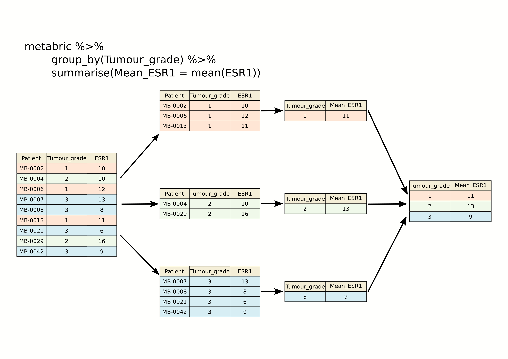
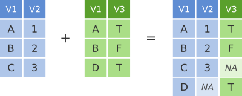

> #### Learning objectives
>
> * Use `group_by()` with `summarise()` to compute summary values for groups of observations
> * Use `count()` to count the numbers of observations within categories
> * Combine data from two tables based on a common identifier (`join` operations)
> * Customize plots created using ggplot2 by changing labels, scales and colours

---

# Grouping and combining data

In this session, we'll look at some more useful functions provided by the
**dplyr** package, the 'workhorse' in the tidyverse family for manipulating
tabular data. Continuing from last week, we'll see how we can summarise data
for groups of observations within different categories. We'll also show how
dplyr allows us to combine data for the same observational unit, e.g. person
or date, that comes from different sources and is read into R in different
tables.

We'll also look at how to customize the plots we create using **ggplot2**, in
particular how we can add or change titles and labels, how we can adjust the
way the axes are displayed and how we can use a colour scheme of our choosing.

**dplyr** and **ggplot2** are core component packages within the tidyverse and
both get loaded as part of the tidyverse.

```{r}
library(tidyverse)
```

To demonstrate how these grouping and combining functions work and to illustrate
customization of plots, we'll again use the METABRIC data set.

```{r message = FALSE}
metabric <- read_csv("data/metabric_clinical_and_expression_data.csv")
metabric
```

---

# Grouping observations

## Summaries for groups

In the previous session we introduced the `summarise()` function for computing
a summary value for one or more variables from all rows in a table (data frame
or tibble). For example, we computed the mean expression of ESR1, the estrogen
receptor alpha gene, as follows.

```{r}
summarise(metabric, mean(ESR1))
```

While the `summarise()` function is useful on its own, it becomes really
powerful when applied to groups of observations within a dataset. For example,
we might be more interested in the mean ESR1 expression calculated separately
for ER positive and ER negative tumours. We could take each group in turn,
filter the data frame to contain only the rows for a given ER status, then apply
the `summarise()` function to compute the mean expression, but that would be
somewhat cumbersome. Even more so if we chose to do this for a categorical
variable with more than two states, e.g. for each of the integrative clusters.
Fortunately, the **`group_by()`** function allows this to be done in one simple
step.

```{r}
metabric %>%
  group_by(ER_status) %>%
  summarise(mean(ESR1))
```

We get an additional column in our output for the categorical variable,
`ER_status`, and a row for each category.

Incidentally, we should expect this result of ER-positive tumours having a
higher expression of ESR1 on average than ER-negative tumours. Simple summaries
like this are a good way of checking that what we think we know actually holds
true in the data we're looking at. Note that the expression values are on a
log~2~scale so ER-positive breast cancers express ESR1 at a level that is
approximately 20 times greater, on average, than that of ER-negative tumours.

```{r}
2 ** (10.6 - 6.21)  # equivalent to (2 ** 10.6) / (2 ** 6.21)
```

Let's have a look at how ESR1 expression varies between the integrative cluster
subtypes defined by the METABRIC study.

```{r}
metabric %>%
  group_by(Integrative_cluster) %>%
  summarise(ESR1 = mean(ESR1))
```

The following schematic contains another example using a simplified subset of
the METABRIC tumour samples to show what's going on.



As we saw last week, we can summarize multiple observations, e.g. the mean
expression for other genes of interest, with `summarise_at()`, this time using
the PAM50 classification to define the groups.

```{r}
metabric %>%
  group_by(PAM50) %>%
  summarise_at(vars(ESR1, PGR, ERBB2), mean)
```

We can also refine our groups by using more than one categorical variable. Let's
subdivide the PAM50 groups by HER2 status to illustrate this.

```{r}
metabric %>%
  group_by(PAM50, HER2_status) %>%
  summarise(ESR1_mean = mean(ESR1))
```

It can be quite useful to know how many observations are within each group. We
can use a special function, **`n()`**, that counts the number of rows rather
than computing a summary value from one of the columns.

```{r}
metabric %>%
  group_by(PAM50, HER2_status) %>%
  summarise(N = n(), ESR1_mean = mean(ESR1))
```

## Counts

Counting observations within groups is such a common operation that dplyr
provides a **`count()`** function to do just that. So we could count the number
of patient samples in each of the PAM50 classes as follows.

```{r}
count(metabric, PAM50)
```

This is much like the `table()` function we've used several times already to
take a quick look at what values are contained in one of the columns in a data
frame. They return different data structures however, with `count()` always
returning a data frame (or tibble) that can then be passed to subsequent steps
in a 'piped' workflow.

If we wanted to subdivide our categories by HER2 status, we can add this as an
additional categorical variable just as we did with the previous `group_by()`
examples.

```{r}
count(metabric, PAM50, HER2_status)
```

The count column is named 'n' by default but you can change this.

```{r}
count(metabric, PAM50, HER2_status, name = "Samples")
```

`count()` is equivalent to grouping observations with `group_by()` and calling
`summarize()` using the special `n()` function to count the number of rows. So
the above statement could have been written in a more long-winded way as
follows.

```{r eval = FALSE}
metabric %>%
  group_by(PAM50, HER2_status) %>%
  summarize(Samples = n())
```

Summarizing with `n()` is useful when showing the number of observations in a
group alongside a summary value, as we did earlier looking at the mean ESR1
expression within specified groups; it allows you to see if you're drawing
conclusions from only a few data points.

## Missing values

Many summarization functions return `NA` if any of the values are missing, i.e.
the column contains `NA` values. As an example, we'll compute the average size
of ER-negative and ER-positive tumours.

```{r}
metabric %>%
  group_by(ER_status) %>%
  summarize(N = n(), `Average tumour size` = mean(Tumour_size))
```

The `mean()` function, along with many similar summarization functions, has an
`na.rm` argument that can be set to `TRUE` to exclude those missing values from
the calculation.

```{r}
metabric %>%
  group_by(ER_status) %>%
  summarize(N = n(), `Average tumour size` = mean(Tumour_size, na.rm = TRUE))
```

An alternative would be to filter out the observations with missing values but
then the number of samples in each ER status group would take on a different
meaning, which may or may not be what we actually want.

```{r}
metabric %>%
  filter(!is.na(Tumour_size)) %>%
  group_by(ER_status) %>%
  summarize(N = n(), `Average tumour size` = mean(Tumour_size))
```

## Counts and proportions

The `sum()` and `mean()` summarization functions are often used with logical
values. It might seem surprising to compute a summary for a logical variable but
but this turns out to be quite a useful thing to do, for counting the number of
`TRUE` values or obtaining the proportion of values that are `TRUE`.

Following on from the previous example we could add a column to our summary of
average tumour size for ER-positive and ER-negative patients that contains the
number of missing values.

```{r}
metabric %>%
  group_by(ER_status) %>%
  summarize(N = n(), Missing = sum(is.na(Tumour_size)), `Average tumour size` = mean(Tumour_size, na.rm = TRUE))
```

Why does this work? Well, the `is.na()` function takes a vector and sees which
values are `NA`, returning a logical vector of `TRUE` where the value was `NA`
and `FALSE` if not.

```{r}
test_vector <- c(1, 3, 2, NA, 6, 5, NA, 10)
is.na(test_vector)
```

The `sum()` function treats the logical vector as a set of `0`s and `1`s where
`FALSE` is `0` and `TRUE` is `1`. In effect `sum()` counts the number of `TRUE`
values.

```{r}
sum(is.na(test_vector))
```

Similarly, `mean()` will compute the proportion of the values that are `TRUE`.

```{r}
mean(is.na(test_vector))
```

So let's calculate the number and proportion of samples that do not have a
recorded tumour size in each of the ER-negative and ER-positive groups.

```{r}
metabric %>%
  group_by(ER_status) %>%
  summarize(N = n(), `Missing tumour size` = sum(is.na(Tumour_size)), `Proportion missing` = mean(is.na(Tumour_size)))
```

We can use `sum()` and `mean()` for any condition that returns a logical vector.
We could, for example, find the number and proportion of patients that survived
longer than 10 years (120 months) in each of the ER-negative and ER-positive
groups.

```{r}
metabric %>%
  filter(Survival_status == "DECEASED") %>%
  group_by(ER_status) %>%
  summarise(N = n(), N_long_survival = sum(Survival_time > 120), Proportion_long_survival = mean(Survival_time > 120))
```

## Selecting or counting distinct things

There are occassions when we want to count the number of distinct values in a
variable or a combination of variables. In this week's assignment, we introduce
another set of data from the METABRIC study which contains details of the
mutations detected by targeted sequencing of a panel of 173 genes. We'll read
this data into R now as this provides a good example of having multiple
observations in different rows for a single observational unit, in this case
several mutations detected in each tumour sample.

```{r message = FALSE}
mutations <- read_csv("data/metabric_mutations.csv")
select(mutations, Patient_ID, Chromosome, Position = Start_Position, Ref = Reference_Allele, Alt = Tumor_Seq_Allele1, Type = Variant_Type, Gene)
```

We can see from just these few rows that each patient sample has multiple
mutations and sometimes there are more than one mutation in the same gene within
a sample, as can be seen in the first two rows at the top of the table above.

If we want to count the number of patients in which mutations were detected we
could select the distinct set of patient identifiers using the **`distinct()`**
function.

```{r}
mutations %>%
  distinct(Patient_ID) %>%
  nrow()
```

Similarly, we could select the distinct set of mutated genes for each patient
as follows.

```{r}
mutations %>%
  distinct(Patient_ID, Gene)
```

This has reduced the number of rows as only distinct combinations of patient
and gene are retained. This would be necessary if we wanted to count the number
of patients that have mutations in each gene rather than the number of mutations
for that gene regardless of the patient.

```{r}
# number of mutations for each gene
count(mutations, Gene)
```

```{r}
# number of tumour samples in which each gene is mutated
mutations %>%
  distinct(Patient_ID, Gene) %>%
  count(Gene)
```

The genes that differ in these two tables are those that have more than one
mutation within a patient tumour sample.

---

# Joining data

In many real life situations, data are spread across multiple tables or
spreadsheets. Usually this occurs because different types of information about a
subject, e.g. a patient, are collected from different sources. It may be
desirable for some analyses to combine data from two or more tables into a
single data frame based on a common column, for example, an attribute that
uniquely identifies the subject such as a patient identifier.

dplyr provides a set of join functions for combining two data frames based on
matches within specified columns. These operations are very similar to carrying
out join operations between tables in a relational database using SQL.

## `left_join`

To illustrate join operations we’ll first consider the most common type, a “left
join”. In the schematic below the two data frames share a common column, V1. We
can combine the two data frames into a single data frame by matching rows in the
first data frame with those in the second data frame that share the same value
of variable V1.


`left_join()` returns all rows from the first data frame regardless of whether
there is a match in the second data frame. Rows with no match are included in
the resulting data frame but have `NA` values in the additional columns coming
from the second data frame.

Here’s an example in which details about members of the Beatles and Rolling
Stones are contained in two tables, using data frames conveniently provided by
dplyr (we'll look at a real example shortly).

The name column identifies each of the band members and is used for matching
rows from the two tables.

```{r}
band_members
band_instruments
left_join(band_members, band_instruments, by = "name")
```

We have joined the band members and instruments tables based on the common
`name` column. Because this is a left join, only observations for band members
in the 'left' table (`band_members`) are included with information brought in
from the 'right' table (`band_instruments`) where such exists. There is no entry
in `band_instruments` for Mick so an `NA` value is inserted into the `plays`
column that gets added in the combined data frame. Keith is only included in
the `band_instruments` data frame so doesn't make it into the final output as
this is based on those band members in the 'left' table.

`right_join()` is similar but returns all rows from the second data frame, i.e.
the 'right' data frame, that have a match with rows in the first data frame.

```{r}
right_join(band_members, band_instruments, by = "name")
```

`right_join()` is used very infrequently compared with `left_join()`.

## `inner_join`

Another joining operation is the "inner join" in which only observations that
are common to both data frames are included.


```{r}
inner_join(band_members, band_instruments, by = "name")
```

In this case when considering observations identified by `name`, only John and
Paul are contained in both the `band_members` and `band_instruments` tables, so
only these make it into the combined table.

## `full_join`

We've seen how missing rows from one table can be retained in the joined data
frame using `left_join` or `right_join` but sometimes data for a given subject
may be missing from either of the tables and we still want that subject to
appear in the combined table. A `full_join` will return all rows and all columns
from the two tables and where there are no matching values, `NA` values are used
to fill in the missing values.



```{r}
full_join(band_members, band_instruments, by = "name")
```

Now, with `full_join()`, we have rows for both Mick and Keith even though they
are only in one or other of the tables being joined.

## Joining on columns with different headers

It isn't uncommon for the columns used for joining two tables to have different
names in each table. Of course we could rename one of the two columns, e.g.
using the dplyr `rename()` function, but the dplyr join functions allow you to
match using differently-named columns as illustrated using another version of
the `band_instruments` data frame.

```{r}
band_instruments2
left_join(band_members, band_instruments2, by = c("name" = "artist"))
```

The name for the column used for joining is the one given in the first table,
i.e. the 'left' table, so `name` rather than `artist` in this case.

## Multiple matches in join operations

You may be wondering what happens if there are multiple rows in one of both of
the two tables for the thing that is being joined, for example what would happen
if our second table had two entries for instruments that Paul plays.

```{r}
band_instruments3 <- tibble(
  name =  c("John",   "Paul", "Paul",   "Keith"),
  plays = c("guitar", "bass", "guitar", "guitar")
)
band_instruments3
left_join(band_members, band_instruments3, by = "name")
```

We get both entries from the second table added to the first table.

Let's add an entry for Paul being in a second band and see what happens then
when we combine the two tables, each with two entries for Paul.

```{r}
band_members3 <- tibble(
  name = c("Mick",   "John",    "Paul",    "Paul"),
  band = c("Stones", "Beatles", "Beatles", "Wings")
)
band_members3
left_join(band_members3, band_instruments3, by = "name")
```

The resulting table includes all combinations of band and instrument for Paul.

## Joining by matching on multiple columns

Sometimes the observations being combined are identified by multiple columns,
for example, a forename and a surname. We can specify a vector of column names
to be used in the join operation.

```{r}
band_members4 <- tibble(
  forename = c("Mick",   "John",    "Paul",      "Mick",  "John"),
  surname =  c("Jagger", "Lennon",  "McCartney", "Avory", "Squire"),
  band =     c("Stones", "Beatles", "Beatles",   "Kinks", "Roses")
)
band_instruments4 <- tibble(
  forename = c("John",   "Paul",      "Keith",    "Mick",  "John"),
  surname =  c("Lennon", "McCartney", "Richards", "Avory", "Squire"),
  plays =    c("guitar", "bass",      "guitar",   "drums", "guitar")
)
full_join(band_members4, band_instruments4, by = c("forename", "surname"))
```

## Clashing column names

Occasionally we may find that there are duplicated columns in the two tables we
want to join, columns that aren't those used for joining. These variables may
even contain different data but happen to have the same name. In such cases
dplyr joins add a suffix to each column in the combined table.

```{r}
band_members5 <- tibble(
  name = c("John", "Paul", "Ringo", "George", "Mick"),
  birth_year = c(1940, 1942, 1940, 1943, 1943),
  band = c("Beatles", "Beatles", "Beatles", "Beatles", "Stones")
)
band_instruments5 <- tibble(
  name = c("John", "Paul", "Ringo", "George"),
  birth_year = c(1940, 1942, 1940, 1943),
  instrument = c("guitar", "bass", "drums", "guitar")
)
left_join(band_members5, band_instruments5, by = "name")
```

It is advisable to rename or remove the duplicated columns that aren't used for
joining.

## Filtering joins

A variation on the join operations we've considered are `semi_join()` and
`anti_join()` that filter the rows in one table based on matches or lack of
matches to rows in another table.

`semi_join()` returns all rows from the first table where there are matches
in the other table.

```{r}
semi_join(band_members, band_instruments, by = "name")
```

`anti_join()` returns all rows where there is no match in the other table, i.e.
those that are unique to the first table.

```{r}
anti_join(band_members, band_instruments, by = "name")
```

## A real example: joining the METABRIC clinical and mRNA expression data

Let's move on to a real example of joining data from two different tables that
we used in putting together the combined METABRIC clinical and expression data
set.

We first read the clinical data into R and then just select a small number of
columns to make it easier to see what is going on when combining the data.

```{r message = FALSE}
clinical_data <- read_csv("data/metabric_clinical_data.csv")
clinical_data <- select(clinical_data, Patient_ID, ER_status, PAM50)
clinical_data
```

We then read in the mRNA expression data that was downloaded separately from
[cBioPortal](https://www.cbioportal.org/study/summary?id=brca_metabric).

```{r message = FALSE}
mrna_expression_data <- read_tsv("data/metabric_mrna_expression.txt")
mrna_expression_data
```

Now we have both sets of data loaded into R as data frames, we can combine them
into a single data frame using an `inner_join()`. Our resulting table will only
contain entries for the patients for which expression data are available.

```{r}
combined_data <- inner_join(clinical_data, mrna_expression_data, by = c("Patient_ID" = "SAMPLE_ID"))
combined_data
```

Having combined the data, we can carry out exploratory data analysis using 
elements from both data sets.

```{r box_plot_1}
combined_data %>%
  filter(!is.na(PAM50), !is.na(ESR1)) %>%
  ggplot(mapping = aes(x = PAM50, y = ESR1, colour = PAM50)) +
  geom_boxplot(show.legend = FALSE)
```

---

# Customizing plots with ggplot2

Finally, we'll turn our attention back to visualization using ggplot2 and how
we can customize our plots by adding or changing titles and labels, changing the
scales used on the x and y axes, and choosing colours.

## Titles and labels

Adding titles and subtitles to a plot and changing the x- and y-axis labels is
very straightforward using the `labs()` function.

```{r scatter_plot_1}
plot <- ggplot(data = metabric, mapping = aes(x = GATA3, y = ESR1, colour = ER_status)) +
  geom_point(size = 0.6, alpha = 0.5) +
  geom_smooth(method = "lm") +
  labs(
    title = "mRNA expression in the METABRIC breast cancer data set",
    subtitle = "GATA3 and ESR1 mRNA expression measured using Illumina HT-12 bead arrays",
    x = "log2 GATA3 expression",
    y = "log2 ESR1 expression",
    colour = "ER status"
  )
plot
```

The labels are another component of the plot object that we've constructed,
along with aesthetic mappings and layers (geoms). The plot object is a list and
contains various elements including those mappings and layers and one element
named `labels`.

`labs()` is a simple function for creating a list of labels you want to specify
as name-value pairs as in the above example. You can name any aesthetic (in this
case x and y) to override the default values (the column names) and you can add a
title, subtitle and caption if you wish. In addition to changing the x- and
y-axis labels, we also removed the underscore from the legend title by setting
the label for the colour aesthetic.

## Scales

Take a look at the x and y scales in the above plot. ggplot2 has chosen the x
and y scales and where to put breaks and ticks.

Let's have a look at the elements of the list object we created that specifies
how the plot should be displayed.

```{r}
names(plot)
```

One of the components of the plot is called `scales`. ggplot2 automatically
adds default scales behind the scenes equivalent to the following:

```{r eval = FALSE}
plot <- ggplot(data = metabric, mapping = aes(x = GATA3, y = ESR1, colour = ER_status)) +
  geom_point(size = 0.6, alpha = 0.5) +
  geom_smooth(method = "lm") +
  scale_x_continuous() +
  scale_y_continuous() +
  scale_colour_discrete()
```

Note that we have three aesthetics and ggplot2 adds a scale for each.

```{r}
plot$mapping
```

The x and y variables (`GATA3` and `ESR1`) are continuous so ggplot2 adds a
continuous scale for each. `ER_status` is a discrete variable in this case so
ggplot2 adds a discrete scale for colour.

Generalizing, the scales that are required follow the naming scheme:

```
scale_<NAME_OF_AESTHETIC>_<NAME_OF_SCALE>
```

Look at the help page for `scale_y_continuous` to see what we can change about
the y-axis scale.

First we'll change the breaks, i.e. where ggplot2 puts ticks and numeric
labels, on the y axis.

```{r scatter_plot_2}
ggplot(data = metabric, mapping = aes(x = GATA3, y = ESR1, colour = ER_status)) +
  geom_point(size = 0.6, alpha = 0.5) +
  geom_smooth(method = "lm") +
  scale_y_continuous(breaks = seq(5, 15, by = 2.5))
```

`seq()` is a useful function for generating regular sequences of numbers. In
this case we wanted numbers from 5 to 15 going up in steps of 2.5.

```{r}
seq(5, 15, by = 2.5)
```

We could do the same thing for the x axis using `scale_x_continuous()`.

We can also adjust the extents of the x or y axis.

```{r scatter_plot_3}
ggplot(data = metabric, mapping = aes(x = GATA3, y = ESR1, colour = ER_status)) +
  geom_point(size = 0.6, alpha = 0.5) +
  geom_smooth(method = "lm") +
  scale_y_continuous(breaks = seq(5, 15, by = 2.5), limits = c(4, 12))
```

Here, just for demonstration purposes, we set the upper limit to be less than
the largest values of ESR1 expression and ggplot2 warned us that some rows have
been removed from the plot.

We can change the minor breaks, e.g. to add more lines that act as guides. These
are shown as thin white lines when using the default theme (we'll take a look at 
alternative themes next week).

```{r scatter_plot_4}
ggplot(data = metabric, mapping = aes(x = GATA3, y = ESR1, colour = ER_status)) +
  geom_point(size = 0.6, alpha = 0.5) +
  geom_smooth(method = "lm") +
  scale_y_continuous(breaks = seq(5, 12.5, by = 2.5), minor_breaks = seq(5, 13.5, 0.5), limits = c(5, 13.5))
```

Or we can remove the minor breaks entirely.

```{r scatter_plot_5}
ggplot(data = metabric, mapping = aes(x = GATA3, y = ESR1, colour = ER_status)) +
  geom_point(size = 0.6, alpha = 0.5) +
  geom_smooth(method = "lm") +
  scale_y_continuous(breaks = seq(6, 14, by = 2), minor_breaks = NULL, limits = c(5, 13.5))
```

Similarly we could remove all breaks entirely.

```{r scatter_plot_6}
ggplot(data = metabric, mapping = aes(x = GATA3, y = ESR1, colour = ER_status)) +
  geom_point(size = 0.6, alpha = 0.5) +
  geom_smooth(method = "lm") +
  scale_y_continuous(breaks = NULL)
```

A more typical scenario would be to keep the breaks, because we want to display
the ticks and their lables, but remove the grid lines. Somewhat confusingly the
position of grid lines are controlled by a scale but preventing these from being
displayed requires changing the theme. The theme controls the way in which
non-data components are displayed -- we'll look at how these can be customized
next week. For now, though, here's an example of turning off the display of all
grid lines for major and minor breaks for both axes.

```{r scatter_plot_7}
ggplot(data = metabric, mapping = aes(x = GATA3, y = ESR1, colour = ER_status)) +
  geom_point(size = 0.6, alpha = 0.5) +
  geom_smooth(method = "lm") +
  scale_y_continuous(breaks = seq(4, 14, by = 2), limits = c(4, 14)) +
  theme(panel.grid = element_blank())
```

By default, the scales are expanded by 5% of the range on either side. We can
add or reduce the space as follows.

```{r scatter_plot_8}
ggplot(data = metabric, mapping = aes(x = GATA3, y = ESR1, colour = ER_status)) +
  geom_point(size = 0.6, alpha = 0.5) +
  geom_smooth(method = "lm") +
  scale_x_continuous(expand = expand_scale(mult = 0.01)) +
  scale_y_continuous(expand = expand_scale(mult = 0.25))
```

Here we only added 1% (0.01) of the range of GATA3 expression values on either
side along the x axis but we added 25% (0.25) of the range of ESR1 expression on
either side along the y axis.

We can move the axis to the other side of the plot –- not sure why you’d want to
do this but with ggplot2 just about anything is possible.

```{r scatter_plot_9}
ggplot(data = metabric, mapping = aes(x = GATA3, y = ESR1, colour = ER_status)) +
  geom_point(size = 0.6, alpha = 0.5) +
  geom_smooth(method = "lm") +
  scale_x_continuous(position = "top")
```

## Colours

The colour asthetic is used with a categorical variable, `ER_status`, in the
scatter plots we've been customizing. The default colour scale used by ggplot2
for categorical variables is `scale_colour_discrete`. We can manually set the
colours we wish to use using `scale_colour_manual` instead.

```{r scatter_plot_10}
ggplot(data = metabric, mapping = aes(x = GATA3, y = ESR1, colour = ER_status)) +
  geom_point(size = 0.6, alpha = 0.5) +
  geom_smooth(method = "lm") +
  scale_colour_manual(values = c("dodgerblue2", "firebrick2"))
```

Setting colours manually is ok when we only have two or three categories but
when we have a larger number it would be handy to be able to choose from a
selection of carefully-constructed colour palettes. Helpfully, ggplot2 provides
access to the [ColorBrewer](http://colorbrewer2.org) palettes through the
functions `scale_colour_brewer()` and `scale_fill_brewer()`.

```{r scatter_plot_11}
ggplot(data = metabric, mapping = aes(x = GATA3, y = ESR1, colour = `3-gene_classifier`)) +
  geom_point(size = 0.6, alpha = 0.5, na.rm = TRUE) +
  scale_colour_brewer(palette = "Set1")
```

Look at the help page for `scale_colour_brewer` to see what other colour
palettes are available and visit the [ColorBrewer](http://colorbrewer2.org)
website to see what these look like.

Interestingly, you can set other attributes other than just the colours at the
same time.

```{r scatter_plot_12}
ggplot(data = metabric, mapping = aes(x = GATA3, y = ESR1, colour = ER_status)) +
  geom_point(size = 0.6, alpha = 0.5) +
  geom_smooth(method = "lm") +
  scale_colour_manual(values = c("dodgerblue2", "firebrick2"), labels = c("ER-negative", "ER-positive")) +
  labs(colour = NULL)  # remove legend title for colour now that the labels are self-explanatory
```

We have applied our own set of mappings from levels in the data to aesthetic
values.

For continuous variables we may wish to be able to change the colours used in the
colour gradient. To demonstrate this we'll correct the Nottingham prognostic index
(NPI) values and use this to colour points in the scatter plot of ESR1 vs GATA3
expression on a continuous scale.

```{r scatter_plot_13}
# Nottingham_prognostic_index is incorrectly calculated in the data downloaded from cBioPortal
metabric <- mutate(metabric, Nottingham_prognostic_index = 0.02 * Tumour_size + Lymph_node_status + Neoplasm_histologic_grade)
#
metabric %>%
  filter(!is.na(Nottingham_prognostic_index)) %>%
  ggplot(mapping = aes(x = GATA3, y = ESR1, colour = Nottingham_prognostic_index)) +
  geom_point(size = 0.5)
```

Higher NPI scores correspond to worse prognosis and lower chance of 5 year
survival. We'll emphasize those points on the scatter plot by adjusting our
colour scale.

```{r scatter_plot_14}
metabric %>%
  filter(!is.na(Nottingham_prognostic_index)) %>%
  ggplot(mapping = aes(x = GATA3, y = ESR1, colour = Nottingham_prognostic_index)) +
  geom_point(size = 0.75) +
  scale_colour_gradient(low = "white", high = "firebrick2")
```

In some cases it might make sense to specify two colour gradients either side
of a mid-point.

```{r scatter_plot_15}
metabric %>%
  filter(!is.na(Nottingham_prognostic_index)) %>%
  ggplot(mapping = aes(x = GATA3, y = ESR1, colour = Nottingham_prognostic_index)) +
  geom_point(size = 0.75) +
  scale_colour_gradient2(low = "dodgerblue1", mid = "grey90", high = "firebrick1", midpoint = 4.5)
```

As before we can override the default labels and other aspects of the colour
scale within the scale function.

```{r scatter_plot_16}
metabric %>%
  filter(!is.na(Nottingham_prognostic_index)) %>%
  ggplot(mapping = aes(x = GATA3, y = ESR1, colour = Nottingham_prognostic_index)) +
  geom_point(size = 0.5) +
  scale_colour_gradient(
    low = "lightblue", high = "darkblue",
    name = "NPI",
    breaks = 2:6,
    limits = c(1.5, 6.5)
  )
```

---

# Summary

In this session we have covered the following:

* Computing summary values for groups of observations
* Counting the numbers of observations within categories
* Combining data from two tables through join operations
* Customizing plots created with ggplot2 by changing labels, scales and colours

---

# Assignment

Assignment: [assignment5.Rmd](assignments/assignment5.Rmd)

Solutions: [assignment5_solutions.Rmd](assignments/assignment5_solutions.Rmd)
and [assignment5_solutions.html](assignments/assignment5_solutions.html)
